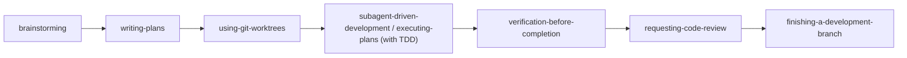
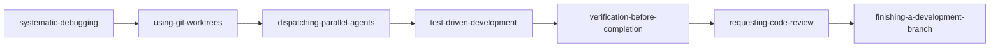
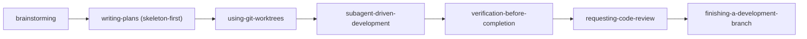
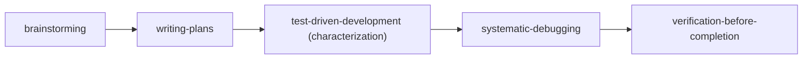

# Superpowers MCP: Composición de skills y flujos de trabajo

[English](skill-compositions.md) | [繁體中文](skill-compositions.zh-TW.md) | [日本語](skill-compositions.ja.md) | [한국어](skill-compositions.ko.md) | [Español](skill-compositions.es.md) | [Português (BR)](skill-compositions.pt-BR.md) | [हिन्दी](skill-compositions.hi.md)

> **Fuente de verdad:** este documento en inglés es canónico. Actualízalo primero cuando cambie el comportamiento de los skills y luego sincroniza las traducciones.


## 1. Elige un flujo de trabajo

Estos prompts son **lanzadores de flujo de trabajo interactivos**, no automatización en el servidor. Seleccionar uno añade instrucciones estructuradas a la conversación; el agente anfitrión debe tener acceso a archivos, terminal y Git, y debe llamar a `read_skill` en cada etapa. El flujo se detiene siempre que un skill requiera aprobación de diseño, revisión del plan o una decisión de finalización de rama.

| Objetivo | MCP Prompt | Qué hace |
| :--- | :--- | :--- |
| Construir una funcionalidad nueva | `feature-pipeline` | Inicia el flujo interactivo completo de funcionalidades. |
| Investigar y corregir un bug complejo | `structured-debug` | Inicia el flujo estructurado de depuración. |
| Planificar una gran refactorización o migración | `skill-composition` con escenario de refactorización | Recomienda el Pipeline 3; aún no hay un prompt lanzador dedicado. |
| Estabilizar un código heredado | `skill-composition` con escenario heredado | Recomienda el Pipeline 4; aún no hay un prompt lanzador dedicado. |

El método de invocación portable es el **menú de MCP Prompts** de tu cliente. Los nombres de slash-command varían según el cliente y pueden incluir el nombre del servidor MCP configurado. Mencionar un prompt por su nombre en el chat ordinario no garantiza que el cliente recupere ese MCP prompt.

La misma guía se expone a los clientes MCP como `guide://superpowers/skill-compositions`.

### Requisitos previos

- Ejecuta en una sesión de agente con acceso al repositorio objetivo, archivos, terminal y Git.
- Crear worktrees requiere un repositorio Git y permiso para crear ramas y directorios.
- `subagent-driven-development` requiere herramientas multiagente del host. Cuando no están disponibles, `feature-pipeline` usa `executing-plans` como alternativa integrada.
- Los pushes, pull requests, merges y limpiezas destructivas siguen siendo decisiones explícitas del usuario.

## 2. Por qué importan las composiciones de skills

Los 15 skills principales de `superpowers-mcp` abarcan todo el ciclo de vida del desarrollo de software (SDLC): desde descubrimiento de requisitos, planificación de arquitectura, configuración de espacios aislados, desarrollo guiado por pruebas (TDD) y depuración sistemática, hasta verificación completa, revisión de código e integración de ramas.

Mientras cada skill atómico actúa como una herramienta de ingeniería de precisión, el desarrollo de nivel productivo requiere **orquestación de flujos**. Las composiciones convierten interacciones ad-hoc con la IA en pipelines disciplinados, reproducibles y con protecciones de seguridad.

---

## 3. Principios arquitectónicos fundamentales

Al componer skills, aplica siempre estos cinco mecanismos de seguridad:

1. **Aislamiento primero (con Git Worktrees)**: Siempre que coordines varios subagentes o depures hipótesis independientes en paralelo, usa `superpowers:using-git-worktrees` para evitar condiciones de carrera y contaminación del espacio de trabajo.
2. **TDD por defecto**: Ninguna modificación de código sin una prueba que falle primero (ciclo Rojo-Verde-Refactorización) para garantizar seguridad contra regresiones.
3. **Puertas de revisión de doble capa**: Nunca omitas las comprobaciones de cumplimiento de spec por tarea ni las revisiones de rama por funcionalidad (`requesting-code-review` / `receiving-code-review`).
4. **Verificación completa antes de finalizar**: Ejecuta toda la suite de pruebas, el verificador de tipos y el linter (`verification-before-completion`) antes de declarar listo o fusionar ramas.
5. **Frontera de seguridad remota (solo commits locales)**: Mantén los commits en local — sin push/pull/fetch salvo que el plan o tu compañero humano lo indique. Crea la rama desde una ref compartida con `--no-track` (o `--unset-upstream` antes del primer commit) para que la rama de funcionalidad nunca rastree una rama compartida, y nunca reescribas una rama compartida (`git revert` es el único remedio que aplicas tú mismo).

---

## 4. Cuatro pipelines estándar

### Pipeline 1: Desarrollo de funcionalidades de extremo a extremo
**Ideal para:** Construir funcionalidades nuevas, módulos grandes o mejoras de subsistemas centrales.



| Paso | Skill | Responsabilidad y entregable |
| :--- | :--- | :--- |
| **1. Requisitos y diseño** | `brainstorming` | Aclara intención, restricciones, decisiones de arquitectura y casos borde; confirma entendimiento compartido, ejecuta la revisión de traspaso a planificación y produce la Spec de diseño. |
| **2. Construcción del plan** | `writing-plans` | Descompone la Spec en tareas pequeñas y verificables con Recommended Skills. |
| **3. Aislamiento del espacio** | `using-git-worktrees` | Crea un worktree Git aislado para proteger la rama principal y el trabajo activo. |
| **4. Ejecución de tareas** | `subagent-driven-development` o `executing-plans` | Usa subagentes nuevos cuando el host los soporta; si no, ejecuta en línea. Carga `test-driven-development` para tareas de implementación y aplica Rojo ➔ Verde ➔ Refactorización. |
| **5. Verificación completa** | `verification-before-completion` | Ejecuta toda la suite de pruebas, linter y comprobaciones de tipos para cero regresiones; cuando no hay comando de pruebas, reabre el artefacto y da cuenta de cada parte de la solicitud. |
| **6. Revisión adversarial** | `requesting-code-review` | Ensambla el paquete de revisión y realiza revisiones integrales de código y arquitectura. |
| **7. Finalización de rama** | `finishing-a-development-branch` | Exporta hallazgos diferidos (checklist de PR o archivo de seguimientos), presenta las opciones de merge/PR/conservar y ejecuta solo la opción elegida. |

---

### Pipeline 2: Resolución estructurada y depuración multifallo
**Ideal para:** Bugs complejos, tests inestables, múltiples fallos o incidentes en producción.



1. **`systematic-debugging`**: Investiga causas raíz y divide los fallos en hipótesis distintas y verificables.
2. **`using-git-worktrees`**: Prepara worktrees aislados para investigaciones paralelas y evita interferencias entre pruebas.
3. **`dispatching-parallel-agents`**: Despacha subagentes concurrentes para validar o invalidar cada hipótesis.
4. **`test-driven-development`**: Escribe pruebas mínimas de reproducción que fallen antes de aplicar correcciones específicas.
5. **`verification-before-completion`**: Valida que todas las pruebas del repositorio pasen con salidas limpias.
6. **`requesting-code-review`** (y `receiving-code-review`): Revisa el delta de la corrección, asegura cobertura defensiva de regresión y resuelve los hallazgos.
7. **`finishing-a-development-branch`**: Fusiona la rama del bugfix, elimina worktrees temporales y limpia el espacio.

---

### Pipeline 3: Refactorización grande y migración de sistemas
**Ideal para:** Refactors arquitectónicos, migraciones de framework o desacoplamiento de servicios.



1. **`brainstorming`**: Define contratos de interfaz, estrategias de transición y criterios de paridad.
2. **`writing-plans` (modo Skeleton-First)**: Diseña primero el slice end-to-end más delgado entre todos los subsistemas.
3. **`using-git-worktrees`**: Establece worktrees de migración dedicados y duraderos.
4. **`subagent-driven-development`**: Ejecuta tareas de refactorización por fases con puertas de revisión obligatorias por tarea.
5. **`verification-before-completion`** + **`requesting-code-review`**: Verificación total de regresión y revisión arquitectónica.
6. **`finishing-a-development-branch`**: Fusiona la rama de migración, limpia worktrees y finaliza la entrega.

---

### Pipeline 4: Red de seguridad para código heredado
**Ideal para:** Códigos heredados sin cobertura automatizada ni patrones consistentes.



1. **`brainstorming`**: Identifica rutas críticas de negocio y módulos de alto riesgo.
2. **`writing-plans`**: Crea la hoja de ruta para añadir pruebas de caracterización y de borde.
3. **`test-driven-development`**: Crea pruebas golden-master y de regresión contra comportamientos existentes con la guardia de caracterización TDD (mutar, verificar fallo, restaurar vía VCS, stay green).
4. **`systematic-debugging`**: Encuentra defectos ocultos que emergen al establecer baselines.
5. **`verification-before-completion`**: Consolida barreras de CI automatizadas.

### Meta skill: Forense de sesiones

Fuera de los cuatro pipelines, **`diagnosing-superpowers`** reconstruye qué falló en una sesión pasada desde sus transcripciones en disco: entrevista inicial, descubrimiento de sesión, informes paralelos con evidencia citada y luego un paquete depurado opcional o borrador de GitHub issue. Úsalo cuando una sesión ignoró el plan, repitió trabajo o produjo un resultado inexplicable — y cuando el hallazgo pertenece upstream, también redacta el informe para mantenedores. El servidor MCP solo sirve el contenido del skill; el agente lee los archivos de transcripción del host con sus propias herramientas, así que ninguna transcripción cruza la frontera del servidor.

---

## 5. Esquema de metadatos de skills en planes

En planes generados por `writing-plans`, especifica los skills recomendados por tarea:

```markdown
### Task 1: Implement Token Authentication Middleware
- **Goal**: Validate JWT tokens and extract user claims
- **Target Files**: `src/auth/jwt.ts`, `tests/auth/jwt.test.ts`
- **Recommended Skill**: `superpowers:test-driven-development`
- **Task Brief**:
  1. Write failing test for expired and invalid signatures (FAIL)
  2. Implement minimal signature verification (PASS)
  3. Refactor with strict type safety
```

### Protocolo de despacho controlador → subagente
Cuando el agente controlador despacha un subagente de tarea:
1. El controlador lee el `Recommended Skill` indicado en la tarea del plan.
2. El controlador inyecta instrucciones o guía al subagente para cargar ese skill vía `read_skill(skill_name)`.
3. El subagente ejecuta bajo la metodología estricta de ese skill (p. ej. Red-Green-Refactor).

---

## 6. Referencia de MCP Prompts nativos

`superpowers-mcp` ofrece MCP prompts nativos listos para usar en IDEs (Cursor, Antigravity, VS Code, Devin Desktop):

| MCP Prompt | Argumentos | Propósito |
| :--- | :--- | :--- |
| **`feature-pipeline`** | `feature_name` requerido, `requirements` opcional | Lanzador interactivo de desarrollo de funcionalidades end-to-end. |
| **`structured-debug`** | `issue_description`, `failing_tests` | Lanzador interactivo de depuración sistemática e investigación multiagente opcional. |
| **`skill-composition`** | `scenario` | Recomendador dinámico de composición para tareas de funcionalidad, debug, refactor o legado. |
| **`session-start`** | - | Inyecta el contexto fundacional de Superpowers y reglas de invocación. |
| **`sdd-implementer`** | `brief_file`, `task_name`, ... | Plantilla de prompt de subagente implementador de tareas SDD. |
| **`sdd-task-reviewer`** | `brief_file`, `report_file`, `review_file`, ... | Plantilla de prompt revisor de spec y calidad por tarea SDD. |
| **`sdd-re-review`** | `brief_file`, `review_file`, `previous_findings`, ... | Plantilla de re-revisor SDD de alcance de ronda de corrección. |
| **`spec-reviewer`** | `spec_file` | Plantilla de prompt revisor adversarial de specs de diseño. |
| **`plan-reviewer`** | `plan_file`, `spec_file` | Plantilla de prompt revisor adversarial de planes de implementación. |

---

## 7. Guía práctica de uso

Con `superpowers-mcp` instalado, parte de un MCP prompt nativo y deja que sus instrucciones carguen los skills necesarios.

### Método A: Menú de MCP Prompts (recomendado)
En un cliente con soporte de MCP prompts:
1. Confirma que el servidor MCP `superpowers` configurado está conectado.
2. **Nueva funcionalidad**: Selecciona `feature-pipeline` e indica `feature_name` más `requirements` opcional.
3. **Resolución y bugfixes**: Selecciona `structured-debug` y pega los logs de error o nombres de pruebas que fallan.
4. **Tareas personalizadas / arquitectura**: Selecciona `skill-composition` para que la IA recomiende el mejor pipeline para tu escenario.

Tu cliente también puede exponer un slash command con namespace. Consulta su selector de prompts para la sintaxis exacta en lugar de asumir que `/feature-pipeline` es portable.

### Método B: Alternativa en lenguaje natural
Puedes pedir al agente que siga un flujo nombrado, pero esto no garantiza que el cliente recupere el MCP prompt nativo. Para uso determinista, selecciónalo desde el menú de MCP Prompts.
- *«Sigue el `feature-pipeline` para construir [Nombre de funcionalidad].»*
- *«Ejecuta el flujo `structured-debug` sobre este error: [Pega error / traza].»*
- *«Aplica el Pipeline de refactorización de `docs/skill-compositions.es.md` para refactorizar [Módulo].»*

### 💬 Ejemplo interactivo paso a paso:
```text
[You]: (Selects the `feature-pipeline` MCP prompt and enters "coupon code checkout system".)
  ↓
[AI]: (Loads brainstorming with `read_skill`) "Understood. Does the coupon have an expiry date, and can it stack with site-wide sales?"
  ↓
[You]: "It has an expiry date, and it cannot stack."
  ↓
[AI]: (After design approval, loads `writing-plans`) "Created implementation plan at docs/superpowers/plans/... Please review."
  ↓
[You]: "Looks good, proceed."
  ↓
[AI]: (Creates or verifies a worktree ➔ uses SDD or the inline fallback ➔ implements via TDD ➔ verifies ➔ reviews ➔ presents branch-finishing choices)
  ↓
[AI]: "All tasks and full test suite passed (100%). Code review clean. Branch ready for merge!"
```
