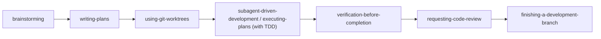
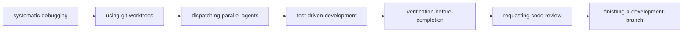
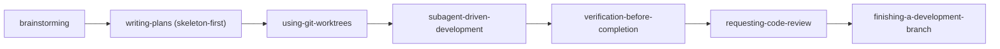

# Superpowers MCP: Skill संयोजन और वर्कफ़्लो पाइपलाइन

[English](skill-compositions.md) | [繁體中文](skill-compositions.zh-TW.md) | [日本語](skill-compositions.ja.md) | [한국어](skill-compositions.ko.md) | [Español](skill-compositions.es.md) | [Português (BR)](skill-compositions.pt-BR.md) | [हिन्दी](skill-compositions.hi.md)

> **प्रामाणिक स्रोत:** यह अंग्रेज़ी दस्तावेज़ canonical है। skill व्यवहार बदलने पर पहले इसे अपडेट करें, फिर अनुवाद sync करें।


## 1. वर्कफ़्लो चुनें

ये prompts **इंटरैक्टिव वर्कफ़्लो लॉन्चर** हैं, सर्वर-साइड स्वचालन नहीं। किसी एक को चुनने से वार्तालाप में संरचित निर्देश जुड़ते हैं; होस्ट एजेंट के पास फ़ाइल, टर्मिनल और Git एक्सेस होना चाहिए और हर चरण में `read_skill` कॉल करना चाहिए। जब भी किसी skill को डिज़ाइन अनुमोदन, योजना समीक्षा या ब्रांच-समापन निर्णय चाहिए, वर्कफ़्लो रुकता है।

| लक्ष्य | MCP Prompt | यह क्या करता है |
| :--- | :--- | :--- |
| नई सुविधा बनाएँ | `feature-pipeline` | पूर्ण इंटरैक्टिव सुविधा वर्कफ़्लो शुरू करता है। |
| जटिल बग की जाँच व सुधार करें | `structured-debug` | संरचित डिबगिंग वर्कफ़्लो शुरू करता है। |
| बड़े रीफ़ैक्टर या माइग्रेशन की योजना बनाएँ | रीफ़ैक्टर परिदृश्य सहित `skill-composition` | Pipeline 3 अनुशंसित करता है; अभी कोई समर्पित लॉन्चर prompt नहीं है। |
| लेगेसी कोडबेस स्थिर करें | लेगेसी परिदृश्य सहित `skill-composition` | Pipeline 4 अनुशंसित करता है; अभी कोई समर्पित लॉन्चर prompt नहीं है। |

पोर्टेबल आह्वान विधि आपके क्लाइंट का **MCP Prompts मेनू** है। Slash-command नाम क्लाइंट अनुसार बदलते हैं और उनमें कॉन्फ़िगर MCP सर्वर नाम शामिल हो सकता है। सामान्य चैट में prompt नाम का उल्लेख मात्र से यह गारंटी नहीं कि क्लाइंट वह MCP prompt लाएगा।

यही मार्गदर्शिका MCP क्लाइंटों को `guide://superpowers/skill-compositions` के रूप में एक्सपोज़ की जाती है।

### पूर्वापेक्षाएँ

- लक्ष्य रिपॉज़िटरी, फ़ाइलों, टर्मिनल और Git तक एक्सेस वाली एजेंट सत्र में चलाएँ।
- Worktree निर्माण हेतु Git रिपॉज़िटरी तथा ब्रांच व डायरेक्टरी बनाने की अनुमति चाहिए।
- `subagent-driven-development` हेतु होस्ट-प्रदत्त मल्टी-एजेंट टूल चाहिए। अनुपलब्ध होने पर `feature-pipeline` इनलाइन फ़ॉलबैक के रूप में `executing-plans` उपयोग करता है।
- Push, pull request, merge और विनाशकारी सफ़ाई स्पष्ट उपयोगकर्ता निर्णय बने रहते हैं।

## 2. Skill संयोजन क्यों महत्वपूर्ण हैं

`superpowers-mcp` के 15 मुख्य skills संपूर्ण सॉफ़्टवेयर विकास जीवनचक्र (SDLC) को कवर करते हैं: आवश्यकता खोज, आर्किटेक्चर योजना, पृथक workspace सेटअप, टेस्ट-चालित विकास (TDD) और व्यवस्थित डिबगिंग से लेकर पूर्ण सत्यापन, कोड समीक्षा और ब्रांच एकीकरण तक।

जहाँ हर atomic skill सटीक इंजीनियरिंग टूल की तरह काम करता है, उत्पादन-स्तरीय विकास हेतु **वर्कफ़्लो ऑर्केस्ट्रेशन** चाहिए। Skill संयोजन तदर्थ AI इंटरैक्शन को अनुशासित, पुनरुत्पादनीय और सुरक्षा-संरक्षित इंजीनियरिंग पाइपलाइनों में बदल देते हैं।

---

## 3. मुख्य आर्किटेक्चर सिद्धांत

Skills संयोजित करते समय ये पाँच सुरक्षा तंत्र हमेशा लागू करें:

1. **पहले पृथक्करण (Git Worktrees द्वारा)**: जब भी कई subagents समन्वयित करें या स्वतंत्र परिकल्पनाएँ समानांतर डिबग करें, फ़ाइलसिस्टम रेस कंडीशन और workspace प्रदूषण से बचने हेतु हमेशा `superpowers:using-git-worktrees` उपयोग करें।
2. **डिफ़ॉल्ट TDD**: पहले असफल टेस्ट (Red-Green-Refactor चक्र) के बिना कोई कोड संशोधन नहीं, ताकि रिग्रेशन सुरक्षा गारंटीकृत हो।
3. **दोहरी-परत समीक्षा गेट**: कार्य-स्तरीय spec अनुपालन जाँच या सुविधा-स्तरीय ब्रांच समीक्षा (`requesting-code-review` / `receiving-code-review`) कभी न छोड़ें।
4. **पूर्ण होने से पहले पूर्ण सत्यापन**: done कहने या ब्रांच मर्ज करने से पहले संपूर्ण टेस्ट सूट, टाइप-चेकर और linter (`verification-before-completion`) चलाएँ।
5. **Remote-सुरक्षा सीमा (केवल स्थानीय commits)**: Commits स्थानीय रखें — योजना या मानव साथी कहे बिना push/pull/fetch नहीं। साझा ref से `--no-track` (या पहले commit से पहले `--unset-upstream`) के साथ ब्रांच बनाएँ ताकि सुविधा ब्रांच कभी साझा ब्रांच को ट्रैक न करे, और साझा ब्रांच कभी rewrite न करें (`git revert` ही एकमात्र उपाय है जो आप स्वयं लगाते हैं)।

---

## 4. चार मानक वर्कफ़्लो पाइपलाइन

### Pipeline 1: एंड-टू-एंड सुविधा विकास
**उपयुक्त:** नई सुविधाएँ, बड़े मॉड्यूल या मुख्य सबसिस्टम संवर्धन बनाना।



| चरण | Skill | उत्तरदायित्व व सुपुर्दगी |
| :--- | :--- | :--- |
| **1. आवश्यकता व डिज़ाइन** | `brainstorming` | आशय, बाधाएँ, आर्किटेक्चर निर्णय और edge cases स्पष्ट करें; साझा समझ पुष्ट करें, योजना-हैंडऑफ़ समीक्षा चलाएँ और डिज़ाइन Spec आउटपुट करें। |
| **2. योजना निर्माण** | `writing-plans` | Spec को Recommended Skills सहित छोटे, परीक्षणयोग्य कार्यों में बाँटें। |
| **3. Workspace पृथक्करण** | `using-git-worktrees` | मुख्य ब्रांच और सक्रिय कार्य की रक्षा हेतु पृथक Git worktree बनाएँ। |
| **4. कार्य निष्पादन** | `subagent-driven-development` या `executing-plans` | होस्ट समर्थित हो तो ताज़ा subagents उपयोग करें; अन्यथा इनलाइन निष्पादित करें। कार्यान्वयन कार्यों हेतु `test-driven-development` लोड करें और Red ➔ Green ➔ Refactor लागू करें। |
| **5. पूर्ण सूट सत्यापन** | `verification-before-completion` | शून्य रिग्रेशन हेतु पूर्ण टेस्ट सूट, linter और टाइप जाँच चलाएँ; जब कोई टेस्ट कमांड न हो, आर्टिफ़ैक्ट पुनः खोलें और अनुरोध के हर भाग का हिसाब दें। |
| **6. प्रतिकूल समीक्षा** | `requesting-code-review` | समीक्षा पैकेज जोड़ें और व्यापक कोड व आर्किटेक्चर समीक्षाएँ करें। |
| **7. ब्रांच समापन** | `finishing-a-development-branch` | विलंबित निष्कर्ष निर्यात करें (PR चेकलिस्ट या committed follow-ups फ़ाइल), फिर उपलब्ध merge/PR/keep विकल्प प्रस्तुत करें और केवल उपयोगकर्ता-चुना विकल्प निष्पादित करें। |

---

### Pipeline 2: संरचित समस्या-निवारण व बहु-विफलता डिबगिंग
**उपयुक्त:** जटिल बग, flaky टेस्ट, कई टेस्ट विफलताएँ या उत्पादन घटनाएँ।



1. **`systematic-debugging`**: मूल कारणों की जाँच करें और विफलताओं को भिन्न, परीक्षणयोग्य परिकल्पनाओं में बाँटें।
2. **`using-git-worktrees`**: समानांतर जाँच हेतु पृथक worktrees प्रावधानित करें ताकि टेस्ट हस्तक्षेप रुके।
3. **`dispatching-parallel-agents`**: प्रत्येक परिकल्पना मान्य/अमान्य करने हेतु समवर्ती subagents भेजें।
4. **`test-driven-development`**: लक्षित बगफ़िक्स लगाने से पहले न्यूनतम असफल पुनरुत्पादन टेस्ट लिखें।
5. **`verification-before-completion`**: मान्य करें कि सभी रिपॉज़िटरी टेस्ट स्वच्छ आउटपुट सहित पास हों।
6. **`requesting-code-review`** (और `receiving-code-review`): सुधार डेल्टा की समीक्षा करें, रक्षात्मक रिग्रेशन कवरेज सुनिश्चित करें और समीक्षा निष्कर्ष सुलझाएँ।
7. **`finishing-a-development-branch`**: बगफ़िक्स ब्रांच मर्ज करें, अस्थायी worktrees हटाएँ और workspace साफ़ करें।

---

### Pipeline 3: बड़ा रीफ़ैक्टरिंग व सिस्टम माइग्रेशन
**उपयुक्त:** आर्किटेक्चर रीफ़ैक्टर, फ़्रेमवर्क माइग्रेशन या सेवा पृथक्करण।



1. **`brainstorming`**: इंटरफ़ेस अनुबंध, संक्रमण रणनीतियाँ और समता मानदंड परिभाषित करें।
2. **`writing-plans` (Skeleton-First मोड)**: पहले सभी सबसिस्टमों में सबसे पतला एंड-टू-एंड slice डिज़ाइन करें।
3. **`using-git-worktrees`**: समर्पित दीर्घजीवी माइग्रेशन worktrees स्थापित करें।
4. **`subagent-driven-development`**: प्रति-कार्य अनिवार्य समीक्षा गेट सहित चरणबद्ध रीफ़ैक्टर कार्य निष्पादित करें।
5. **`verification-before-completion`** + **`requesting-code-review`**: पूर्ण रिग्रेशन सत्यापन और आर्किटेक्चर समीक्षा।
6. **`finishing-a-development-branch`**: माइग्रेशन ब्रांच मर्ज करें, worktrees साफ़ करें और डिलीवरी अंतिम करें।

---

### Pipeline 4: लेगेसी कोडबेस सुरक्षा-जाल
**उपयुक्त:** स्वचालित टेस्ट कवरेज या सुसंगत पैटर्न रहित लेगेसी कोडबेस।


1. **`brainstorming`**: महत्वपूर्ण व्यवसाय पथ और उच्च-जोखिम मॉड्यूल पहचानें।
2. **`writing-plans`**: characterization और सीमा टेस्ट जोड़ने का रोडमैप बनाएँ।
3. **`test-driven-development`**: TDD characterization गार्ड से मौजूदा व्यवहारों पर golden-master और रिग्रेशन टेस्ट लिखें (mutate, विफलता सत्यापित, VCS से restore, stay green)।
4. **`systematic-debugging`**: टेस्ट आधार स्थापित करते समय उभरे छिपे दोषों का मूल-कारण खोजें।
5. **`verification-before-completion`**: स्वचालित CI टेस्ट अवरोध सुदृढ़ करें।

### Meta Skill: सत्र फॉरेंसिक

चार पाइपलाइनों से बाहर, **`diagnosing-superpowers`** डिस्क पर ट्रांसक्रिप्ट से पिछली सत्र की गड़बड़ी का पुनर्निर्माण करता है: intake साक्षात्कार, सत्र खोज, उद्धृत साक्ष्य सहित समानांतर विश्लेषक रिपोर्ट, फिर वैकल्पिक स्क्रब बंडल या GitHub issue मसौदा। जब सत्र योजना अनदेखा करे, कार्य दोहराए या अव्याख्येय परिणाम दे — और जब निष्कर्ष upstream का हो, तो मेंटेनर रिपोर्ट भी मसौदित करता है। MCP सर्वर केवल skill सामग्री परोसता है; एजेंट होस्ट की ट्रांसक्रिप्ट फ़ाइलें अपने टूलों से पढ़ता है, इसलिए कोई ट्रांसक्रिप्ट सर्वर सीमा पार नहीं करती।

---

## 5. योजनाओं में skill मेटाडेटा स्कीमा

`writing-plans` द्वारा जेनरेट योजनाओं में हर कार्य हेतु अनुशंसित skills निर्दिष्ट करें:

```markdown
### Task 1: Implement Token Authentication Middleware

**Files:**
- Create: `src/auth/jwt.ts`
- Test: `tests/auth/jwt.test.ts`

**Recommended Skill:** `superpowers:test-driven-development` (or relevant skill)

**Checklist:**
- [ ] 1. Write failing test for expired and invalid signatures (FAIL) — verify with: `npm test`
- [ ] 2. Implement minimal signature verification (PASS) — verify with: `npm test`
- [ ] 3. Refactor with strict type safety — verify with: `npx tsc --noEmit`
```

### नियंत्रक-से-subagent प्रेषण प्रोटोकॉल
जब नियंत्रक एजेंट कार्य subagent भेजता है:
1. नियंत्रक योजना कार्य में निर्दिष्ट `Recommended Skill` पढ़ता है।
2. नियंत्रक निर्देश इंजेक्ट करता है या subagent को `read_skill(skill_name)` से वह skill लोड करने हेतु मार्गदर्शित करता है।
3. Subagent उस skill की सख्त पद्धति से निष्पादित करता है (उदा. Red-Green-Refactor)।

---

## 6. नेटिव MCP Prompts संदर्भ

`superpowers-mcp` IDEs (Cursor, Antigravity, VS Code, Devin Desktop) में नेटिव, उपयोग-तैयार MCP prompts देता है:

| MCP Prompt | तर्क | उद्देश्य |
| :--- | :--- | :--- |
| **`feature-pipeline`** | आवश्यक `feature_name`, वैकल्पिक `requirements` | एंड-टू-एंड सुविधा विकास हेतु इंटरैक्टिव लॉन्चर। |
| **`structured-debug`** | `issue_description`, `failing_tests` | व्यवस्थित डिबगिंग और वैकल्पिक मल्टी-एजेंट जाँच हेतु इंटरैक्टिव लॉन्चर। |
| **`skill-composition`** | `scenario` | सुविधा, debug, refactor या लेगेसी कार्यों हेतु गतिशील skill संयोजन अनुशंसक। |
| **`session-start`** | - | आधारभूत Superpowers संदर्भ और skill आह्वान नियम इंजेक्ट करता है। |
| **`sdd-implementer`** | `brief_file`, `task_name`, ... | SDD कार्य कार्यान्वयनकर्ता subagent prompt टेम्पलेट। |
| **`sdd-task-reviewer`** | `brief_file`, `report_file`, `review_file`, ... | SDD प्रति-कार्य spec व गुणवत्ता समीक्षक prompt टेम्पलेट। |
| **`sdd-re-review`** | `brief_file`, `review_file`, `previous_findings`, ... | SDD सुधार-राउंड सीमित पुनः-समीक्षक prompt टेम्पलेट। |
| **`spec-reviewer`** | `spec_file` | प्रतिकूल डिज़ाइन spec समीक्षक prompt टेम्पलेट। |
| **`plan-reviewer`** | `plan_file`, `spec_file` | प्रतिकूल कार्यान्वयन योजना समीक्षक prompt टेम्पलेट। |

---

## 7. व्यावहारिक उपयोग मार्गदर्शिका

`superpowers-mcp` इंस्टॉल होने पर नेटिव MCP prompt से शुरू करें और उसके निर्देशों को आवश्यक skills लोड करने दें।

### विधि A: MCP Prompts मेनू (अनुशंसित)
MCP prompts समर्थित क्लाइंट में:
1. पुष्टि करें कि कॉन्फ़िगर `superpowers` MCP सर्वर जुड़ा है।
2. **नई सुविधा विकास**: `feature-pipeline` चुनें और `feature_name` तथा वैकल्पिक `requirements` दें।
3. **समस्या-निवारण व बगफ़िक्स**: `structured-debug` चुनें और त्रुटि लॉग या असफल टेस्ट नाम चिपकाएँ।
4. **कस्टम / आर्किटेक्चर कार्य**: अपने परिदृश्य हेतु सर्वोत्तम पाइपलाइन AI से अनुशंसित कराने हेतु `skill-composition` चुनें।

आपका क्लाइंट नेमस्पेस्ड slash command भी एक्सपोज़ कर सकता है। `/feature-pipeline` पोर्टेबल मानने के बजाय सटीक सिंटैक्स हेतु उसका prompt picker देखें।

### विधि B: प्राकृतिक-भाषा फ़ॉलबैक
आप एजेंट से नामित वर्कफ़्लो अनुसरण करने को कह सकते हैं, पर यह गारंटी नहीं कि क्लाइंट नेटिव MCP prompt लाएगा। नियतात्मक उपयोग हेतु MCP Prompts मेनू से चुनें।
- *"कृपया [सुविधा नाम] बनाने हेतु `feature-pipeline` अनुसरण करें।"*
- *"इस त्रुटि पर `structured-debug` वर्कफ़्लो चलाएँ: [त्रुटि / trace चिपकाएँ]।"*
- *"[मॉड्यूल] रीफ़ैक्टर करने हेतु `docs/skill-compositions.hi.md` से Refactoring Pipeline लागू करें।"*

### 💬 इंटरैक्टिव चरण-दर-चरण वॉकथ्रू उदाहरण:
```text
[You]: (Selects the `feature-pipeline` MCP prompt and enters "coupon code checkout system".)
  ↓
[AI]: (Loads brainstorming with `read_skill`) "Understood. Does the coupon have an expiry date, and can it stack with site-wide sales?"
  ↓
[You]: "It has an expiry date, and it cannot stack."
  ↓
[AI]: (After design approval, loads `writing-plans`) "Created implementation plan at docs/superpowers/plans/... Please review."
  ↓
[You]: "Looks good, proceed."
  ↓
[AI]: (Creates or verifies a worktree ➔ uses SDD or the inline fallback ➔ implements via TDD ➔ verifies ➔ reviews ➔ presents branch-finishing choices)
  ↓
[AI]: "All tasks and full test suite passed (100%). Code review clean. Branch ready for merge!"
```
