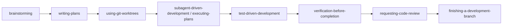
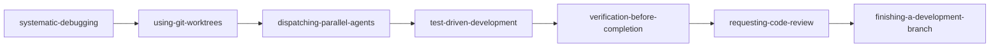
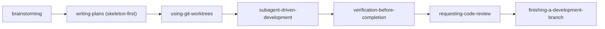
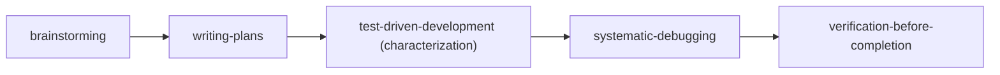

# Superpowers MCP: スキル構成 & ワークフローパイプライン (Skill Compositions & Workflow Pipelines)

[English](skill-compositions.md) | [繁體中文](skill-compositions.zh-TW.md) | [日本語](skill-compositions.ja.md) | [한국어](skill-compositions.ko.md)

## 1. スキル構成が重要な理由 (Why Skill Compositions Matter)

`superpowers-mcp` に含まれる 14 のコアスキルは、要件の明確化、アーキテクチャ設計、分離されたワークスペースの構築、テスト駆動開発 (TDD)、体系的なデバッグから、完全検証、コードレビュー、ブランチ統合に至るまで、ソフトウェア開発ライフサイクル (SDLC) 全体を網羅しています。

各スキルは単体でも高精度なエンジニアリングツールですが、実践的な開発には「ワークフローのオーケストレーション（編排）」が不可欠です。スキル構成（Skill Composition）によって、アドホックな AI 操作を、規律ある再現可能で安全保護されたエンジニアリングパイプラインへと昇華させます。

---

## 2. コアアーキテクチャ原則 (Core Architectural Principles)

スキルを組み合わせる際は、常に以下の 4 つの安全防御メカニズムを適用してください。

1. **物理的分離を最優先 (Isolation First via Git Worktrees)**：マルチエージェント協調や複数仮説の並行デバッグを行う際は、必ず `superpowers:using-git-worktrees` を使用して独立したディレクトリを作成し、ファイル競合 (Race Condition) や環境汚染を防止します。
2. **デフォルトでテスト駆動 (TDD by Default)**：回帰安全性を担保するため、失敗するテスト（Red ➔ Green ➔ Refactor）を事前に作成せずにコードを変更してはなりません。
3. **2 層レビューゲート (Dual-layer Review)**：タスク単位の仕様準拠チェックおよびフィーチャー全体のブランチレビュー（`requesting-code-review` / `receiving-code-review`）を省略してはなりません。
4. **完了前の完全検証 (Verification Before Completion)**：完了を宣言したりブランチをマージする前に、必ずリポジトリ全体のテストスイート、Linter、型チェック（`verification-before-completion`）を実行します。

---

## 3. 4 つの標準ワークフローパイプライン (Standard Pipelines)

## 3. 4つの標準スキル構成パイプライン (Four Standard Workflow Pipelines)

### パイプライン 1: エンドツーエンド新機能開発 (Feature Development Pipeline)
**推奨用途：** 新機能のスクラッチ開発、主要モジュールの追加、コアプロセスのリファクタリング。



| ステップ | スキル (Skill) | 責務と成果物 |
| :--- | :--- | :--- |
| **1. 要件と設計** | `brainstorming` | 要件、制約、アーキテクチャ上の決定事項を整理し、仕様書 (Spec) を出力。 |
| **2. 計画策定** | `writing-plans` | 仕様書を独立して検証可能なタスクリストに分解し、Recommended Skill を明記。 |
| **3. 環境分離** | `using-git-worktrees` | 独立した Git Worktree を作成し、メインブランチと作業環境を保護。 |
| **4. タスク実行** | `subagent-driven-development` | 独立したサブエージェントを順次起動し、クリーンなコンテキストでタスクを実行。 |
| **5. ロジック実装** | `test-driven-development` | 各タスクのビジネスロジックに対して Red ➔ Green ➔ Refactor を厳格に適用。 |
| **6. フルテスト検証** | `verification-before-completion` | フルテストスイート、Linter、型チェックを実行し、回帰がないことを確認。 |
| **7. コードレビュー** | `requesting-code-review` | レビューパッケージを生成し、多角的なコード＆アーキテクチャレビューを実施。 |
| **8. ブランチ完了** | `finishing-a-development-branch` | マージ/PR、Worktree の整理、一時ブランチの削除を行いクリーンに完了。 |

---

### パイプライン 2: 構造化トラブルシューティング (Structured Troubleshooting Pipeline)
**推奨用途：** 複数テストの失敗、再現困難なバグ、本番障害の調査。



1. **`systematic-debugging`**：根本原因を分析し、独立して検証可能な仮説に分解。
2. **`using-git-worktrees`**：並行調査用に分離された Worktree を準備し、テストやファイル競合を防止。
3. **`dispatching-parallel-agents`**：サブエージェントを並行ディスパッチして各仮説を検証。
4. **`test-driven-development`**：バグを再現する最小限の失敗テストを作成した上で修正を実施。
5. **`verification-before-completion`**：全テストが正常に通過することを検証。
6. **`requesting-code-review`**（および `receiving-code-review`）：修正差分と回帰テストの網羅性をレビューし、指摘事項を解消。
7. **`finishing-a-development-branch`**：バグ修正ブランチをマージ/PRし、一時 Worktree を安全にクリーンアップ。

---

### パイプライン 3: 大規模リファクタリング & システム移行 (Large Refactoring & Migration Pipeline)
**推奨用途：** コアアーキテクチャの再構築、フレームワーク移行、サービス分離。



1. **`brainstorming`**：インターフェース互換性、移行手順、同等性検証基準を定義。
2. **`writing-plans` (Skeleton-First モード)**：全サブシステムを貫通する最小限のエンドツーエンド骨格を設計。
3. **`using-git-worktrees`**：移行作業専用の長期 Worktree を構築。
4. **`subagent-driven-development`**：段階的にリファクタリングを実行し、タスクごとにレビューを実施。
5. **`verification-before-completion`** + **`requesting-code-review`**：完全な回帰検証と専門家によるレビュー。
6. **`finishing-a-development-branch`**：移行ブランチをマージし、Worktree を整理して完了。

---

### パイプライン 4: レガシーコードベース安全網の構築 (Legacy Codebase Safety Net)
**推奨用途：** 単体テストが不足している、または構造が乱雑なレガシーコードベース。



1. **`brainstorming`**：システムの境界、既存動作の仕様化目標を特定。
2. **`writing-plans`**：仕様化テスト（Characterization Tests）作成計画を策定。
3. **`test-driven-development`**：既存の振る舞いを保護する網羅的テストを作成。
4. **`systematic-debugging`**：保護テストで発見された潜在的欠陥を特定・修正。
5. **`verification-before-completion`**：安全網の完全性を検証。

---

## 4. スキル作成とメタデータ標準 (Skill Authoring & Metadata Standards)

`writing-plans` で作成する実装計画において、各タスクに推奨スキルを指定できます：

```markdown
### Task 1: トークン認証ミドルウェアの実装
- **Goal**: JWT トークンの検証とクレーム抽出
- **Target Files**: `src/auth/jwt.ts`, `tests/auth/jwt.test.ts`
- **Recommended Skill**: `superpowers:test-driven-development`
- **Task Brief**:
  1. 期限切れおよび無効な署名の失敗テストを作成 (FAIL)
  2. 最小限の検証ロジックを実装してパスさせる (PASS)
  3. 厳格な型安全性を確保してリファクタリング
```

### コントローラーとサブエージェントのディスパッチプロトコル
コントローラーエージェントがタスクサブエージェントを起動する際：
1. コントローラーは計画タスクに指定された `Recommended Skill` を読み取ります。
2. コントローラーは `read_skill(skill_name)` を介してそのスキルを読み込むようサブエージェントに指示します。
3. サブエージェントはそのスキルの厳格な手法（Red-Green-Refactor など）に従って実装を実行します。

---

## 5. ネイティブ MCP Prompts 一覧

`superpowers-mcp` は主要な MCP クライアント（Cursor、Antigravity、VS Code、Claude Desktop など）で利用可能な標準 Prompts を提供します：

| MCP Prompt 名 | 引数 | 用途 |
| :--- | :--- | :--- |
| **`feature-pipeline`** | `feature_name`, `requirements` | 新機能開発のワンクリックワークフローオーケストレーター。 |
| **`structured-debug`** | `issue_description`, `failing_tests` | 体系的デバッグ＆並行エージェント調査のオーケストレーター。 |
| **`skill-composition`** | `scenario` | 開発シナリオに応じた動的スキル構成ガイド。 |
| **`session-start`** | - | Superpowers の基本環境とスキル利用ルールを注入。 |
| **`sdd-implementer`** | `brief_file`, `task_name`, ... | SDD タスク実装サブエージェント用プロンプト。 |
| **`sdd-task-reviewer`** | `brief_file`, `report_file`, ... | SDD 単一タスクレビュー用プロンプト。 |
| **`sdd-re-review`** | `brief_file`, `previous_findings`, ... | SDD 修正ラウンド差分レビュー用プロンプト。 |
| **`spec-reviewer`** | `spec_file` | 設計仕様書レビュー用プロンプト。 |
| **`plan-reviewer`** | `plan_file`, `spec_file` | 実装計画書レビュー用プロンプト。 |

---

## 6. IDE での実際の操作方法 (How to Use in Practice)

`superpowers-mcp` を設定すれば、**14 個の個別スキル名を覚える必要は一切ありません**。以下の 2 つの方法で簡単に利用できます：

### 方法 A: IDE の MCP Prompts を使用（推奨・ワンクリック起動）
Cursor、Antigravity、VS Code、Claude Desktop、Windsurf などのチャット入力欄で：
1. **新機能開発**：`/feature-pipeline` と入力するか、Prompts 一覧から `feature-pipeline` を選択して要件を入力します。
2. **バグ修正・テスト失敗**：`structured-debug` を選択し、エラーログやテスト名を貼り付けます。
3. **ワークフローに迷った時**：`skill-composition` を選択すると、現在の状況に応じた最適なパイプラインが自動提案されます。

### 方法 B: 自然言語で直接指示
通常のチャットでパイプライン名を指定するだけで、AI が自動的にワークフローを適用します：
- *「`feature-pipeline` の手順に従って、[機能名] の開発を進めてください」*
- *「`structured-debug` を使用して、次のエラーを調査・修正してください：[エラー貼り付け]」*
- *「`docs/skill-compositions.ja.md` のリファクタリングパイプラインを適用して [モジュール名] を再構築してください」*

### 💬 実際の対話フロー例（新機能開発の場合）：
```text
【ユーザー】:「feature-pipeline に従ってクーポンの割引チェックアウト機能を実装して」
  ↓
【AI】: (brainstorming を自動実行) 「承知いたしました。クーポンの有効期限や他の割引との重複適用の可否について確認させてください」
  ↓
【ユーザー】:「有効期限あり、重複適用は不可でお願いします」
  ↓
【AI】: (writing-plans を自動実行) 「設計が完了し、docs/superpowers/plans/... に実装計画を作成しました。ご確認ください」
  ↓
【ユーザー】:「計画に問題ありません。進めてください」
  ↓
【AI】: (Worktree 分離 ➔ SDD 起動 ➔ 各タスクを TDD で実装 ➔ フルテスト検証 ➔ コードレビュー ➔ ブランチ完了)
  ↓
【AI】: 「全タスクの実装およびリポジトリ全体のテストが 100% 成功しました。レビューも完了し、ブランチが整いました！」
```
