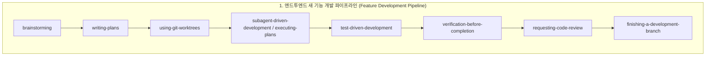
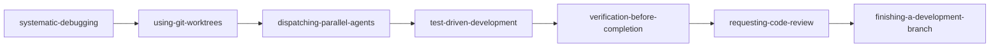

# Superpowers MCP: 스킬 조합 및 워크플로우 파이프라인 (Skill Compositions & Workflow Pipelines)

[English](skill-compositions.md) | [繁體中文](skill-compositions.zh-TW.md) | [日本語](skill-compositions.ja.md) | [한국어](skill-compositions.ko.md)

## 1. 스킬 조합이 중요한 이유 (Why Skill Compositions Matter)

`superpowers-mcp`의 14개 핵심 스킬은 요구사항 명확화, 아키텍처 설계, 격리된 작업 환경 구축, 테스트 주도 개발(TDD), 체계적 디버깅부터 전체 검증, 코드 리뷰, 브랜치 통합에 이르기까지 소프트웨어 개발 라이프사이클(SDLC) 전반을 다룹니다.

각 스킬은 단독으로도 정밀한 엔지니어링 도구 역할을 하지만, 실제 프로덕션 개발에는 **워크플로우 오케스트레이션(편성)**이 필수적입니다. 스킬 조합(Skill Composition)을 통해 임의적인 AI 상호작용을 체계적이고 재현 가능하며 안전하게 보호되는 엔지니어링 파이프라인으로 전환합니다.

---

## 2. 핵심 아키텍처 원칙 (Core Architectural Principles)

스킬을 조합할 때는 항상 다음 4가지 안전 보호 메커니즘을 준수해야 합니다:

1. **물리적 격리 최우선 (Isolation First via Git Worktrees)**: 다중 에이전트 협업이나 여러 가설의 병렬 디버깅 시 항상 `superpowers:using-git-worktrees`를 사용하여 독립된 디렉토리를 생성하고 파일 충돌(Race Condition)과 작업 환경 오염을 방지합니다.
2. **기본적인 테스트 주도 개발 (TDD by Default)**: 회귀 안전성을 보장하기 위해 실패하는 테스트(Red ➔ Green ➔ Refactor)를 먼저 작성하지 않고 코드를 수정해서는 안 됩니다.
3. **이중 검토 게이트 (Dual-layer Review)**: 태스크 단위의 스펙 준수 검사와 피처 전체의 브랜치 리뷰(`requesting-code-review` / `receiving-code-review`)를 생략해서는 안 됩니다.
4. **완료 전 전체 검증 (Verification Before Completion)**: 완료를 선언하거나 브랜치를 병합하기 전에 반드시 전체 테스트 스위트, Linter, 타입 검사(`verification-before-completion`)를 실행합니다.

---

## 3. 4대 표준 워크플로우 파이프라인 (Standard Pipelines)



### 파이프라인 1: 엔드투엔드 새 기능 개발 (Feature Development Pipeline)
**권장 시나리오:** 새 기능 초기 개발, 주요 모듈 추가, 핵심 프로세스 리팩토링.

| 단계 | 스킬 (Skill) | 역할 및 산출물 |
| :--- | :--- | :--- |
| **1. 요구사항 및 설계** | `brainstorming` | 요구사항, 제약사항, 아키텍처 결정을 명확히 하고 설계 스펙(Spec) 산출. |
| **2. 계획 수립** | `writing-plans` | 스펙을 독립 검증 가능한 태스크 목록으로 분해하고 Recommended Skill 명시. |
| **3. 환경 격리** | `using-git-worktrees` | 격리된 Git Worktree를 생성하여 메인 브랜치와 작업 환경 보호. |
| **4. 태스크 실행** | `subagent-driven-development` | 독립된 서브에이전트를 순차 실행하여 깨끗한 컨텍스트 유지. |
| **5. 로직 구현** | `test-driven-development` | 각 태스크의 비즈니스 로직에 대해 Red ➔ Green ➔ Refactor 주기 엄격 준수. |
| **6. 전체 검증** | `verification-before-completion` | 전체 테스트 스위트, Linter, 타입 검사를 실행하여 회귀가 없음을 확인. |
| **7. 코드 리뷰** | `requesting-code-review` | 리뷰 패키지를 생성하고 다각적인 코드 및 아키텍처 리뷰 수행. |
| **8. 브랜치 마무리** | `finishing-a-development-branch` | 병합/PR, Worktree 정리, 임시 브랜치 삭제를 통해 깔끔하게 완료. |

---

### 파이프라인 2: 구조화된 문제 해결 (Structured Troubleshooting Pipeline)
**권장 시나리오:** 다중 테스트 실패, 재현하기 어려운 버그, 프로덕션 장애 조사.



1. **`systematic-debugging`**: 근본 원인을 분석하고 독립적으로 검증 가능한 가설로 분해.
2. **`using-git-worktrees`**: 병렬 조사를 위한 격리된 Worktree를 준비하여 테스트 및 파일 간섭 방지.
3. **`dispatching-parallel-agents`**: 서브에이전트를 병렬 디스패치하여 각 가설 검증.
4. **`test-driven-development`**: 버그를 재현하는 최소한의 실패 테스트를 작성한 후 수정 적용.
5. **`verification-before-completion`**: 모든 테스트가 성공적으로 통과하는지 검증.
6. **`requesting-code-review`** (및 `receiving-code-review`): 수정 사항과 회귀 테스트 적용 범위 검토 및 지적 사항 해결.
7. **`finishing-a-development-branch`**: 버그 수정 브랜치를 병합/PR하고 임시 Worktree를 안전하게 정리.

---

### 파이프라인 3: 대규모 리팩토링 및 시스템 마이그레이션 (Large Refactoring & Migration Pipeline)
**권장 시나리오:** 핵심 아키텍처 재구축, 프레임워크 업그레이드, 서비스 분리.

1. **`brainstorming`**: 인터페이스 호환성, 전환 전략, 동등성 검증 기준 정의.
2. **`writing-plans` (Skeleton-First 모드)**: 모든 서브시스템을 관통하는 최소 엔드투엔드 뼈대 설계.
3. **`using-git-worktrees`**: 마이그레이션 전용 장기 Worktree 구성.
4. **`subagent-driven-development`**: 단계별 리팩토링을 수행하고 태스크별 검토 게이트 유지.
5. **`verification-before-completion`** + **`requesting-code-review`**: 완전한 회귀 검증 및 전문가 아키텍처 검토.
6. **`finishing-a-development-branch`**: 마이그레이션 브랜치를 병합하고 Worktree를 정리하여 완료.

---

### 파이프라인 4: 레거시 코드베이스 안전망 구축 (Legacy Codebase Safety Net)
**권장 시나리오:** 단위 테스트가 부족하거나 구조가 복잡한 레거시 코드베이스.

1. **`brainstorming`**: 핵심 비즈니스 경로와 고위험 모듈 식별.
2. **`writing-plans`**: 특성화 테스트(Characterization Tests) 추가 로드맵 수립.
3. **`test-driven-development`**: 기존 동작에 대한 골든 마스터 및 회귀 테스트 작성.
4. **`systematic-debugging`**: 테스트 추가 과정에서 발견된 잠재 결함 해결.
5. **`verification-before-completion`**: 자동화된 CI 테스트 장벽 구축.

---

## 4. 계획 기반 스킬 구성 스키마 (Plan-Driven Skill Metadata Schema)

`writing-plans`로 생성된 구현 계획에서 각 태스크별 권장 스킬을 지정할 수 있습니다:

```markdown
### Task 1: 토큰 인증 미들웨어 구현
- **Goal**: JWT 토큰 검증 및 클레임 추출
- **Target Files**: `src/auth/jwt.ts`, `tests/auth/jwt.test.ts`
- **Recommended Skill**: `superpowers:test-driven-development`
- **Task Brief**:
  1. 만료 및 유효하지 않은 서명에 대한 실패 테스트 작성 (FAIL)
  2. 최소한의 검증 로직을 구현하여 테스트 통과 (PASS)
  3. 엄격한 타입 안전성을 확보하며 리팩토링
```

### 컨트롤러와 서브에이전트 디스패치 프로토콜
컨트롤러 에이전트가 태스크 서브에이전트를 생성할 때:
1. 컨트롤러는 계획 작업에 명시된 `Recommended Skill`을 읽습니다.
2. 컨트롤러는 `read_skill(skill_name)`을 통해 해당 스킬을 로드하도록 서브에이전트에 지시합니다.
3. 서브에이전트는 해당 스킬의 엄격한 방법론(Red-Green-Refactor 등)을 준수하여 구현을 진행합니다.

---

## 5. 네이티브 MCP Prompts 레퍼런스

`superpowers-mcp`는 주요 IDE(Cursor, Antigravity, VS Code, Claude Desktop 등)에서 즉시 사용할 수 있는 표준 Prompts를 제공합니다:

| MCP Prompt 명 | 매개변수 | 용도 |
| :--- | :--- | :--- |
| **`feature-pipeline`** | `feature_name`, `requirements` | 새 기능 개발을 위한 원클릭 워크플로우 오케스트레이터. |
| **`structured-debug`** | `issue_description`, `failing_tests` | 체계적 디버깅 및 다중 에이전트 조사를 위한 오케스트레이터. |
| **`skill-composition`** | `scenario` | 개발 시나리오에 맞춘 동적 스킬 조합 가이드. |
| **`session-start`** | - | Superpowers 기본 환경 및 스킬 호출 규칙 주입. |
| **`sdd-implementer`** | `brief_file`, `task_name`, ... | SDD 태스크 구현 서브에이전트 프롬프트. |
| **`sdd-task-reviewer`** | `brief_file`, `report_file`, ... | SDD 단일 태스크 검토 서브에이전트 프롬프트. |
| **`sdd-re-review`** | `brief_file`, `previous_findings`, ... | SDD 수정 라운드 차분 검토 프롬프트. |
| **`spec-reviewer`** | `spec_file` | 설계 스펙 검토 프롬프트. |
| **`plan-reviewer`** | `plan_file`, `spec_file` | 구현 계획 검토 프롬프트. |

---

## 6. IDE에서 실제로 사용하는 방법 (How to Use in Practice)

`superpowers-mcp`를 설정하면 **14개의 개별 스킬 이름을 일일이 기억할 필요가 없습니다**. 아래의 두 가지 간단한 방법으로 시작할 수 있습니다:

### 방법 A: IDE의 MCP Prompts 사용 (가장 권장, 원클릭 시작)
Cursor, Antigravity, VS Code, Claude Desktop, Windsurf 등의 대화창에서:
1. **새 기능 개발**: `/feature-pipeline`을 입력하거나 Prompts 메뉴에서 `feature-pipeline`을 선택하고 요구사항을 전달합니다.
2. **버그 해결 / 테스트 실패**: `structured-debug`를 선택하고 오류 로그 또는 실패한 테스트를 붙여넣습니다.
3. **적절한 흐름을 모를 때**: `skill-composition`을 선택하여 현재 상황에 맞는 맞춤형 파이프라인을 추천받습니다.

### 방법 B: 자연어로 직접 지시하기
일반 대화창에서 파이프라인 이름을 지정하기만 하면 AI가 표준 파이프라인을 자동으로 인식하여 로드합니다:
- *"`feature-pipeline` 흐름에 따라 [기능 이름] 개발을 진행해줘."*
- *"`structured-debug` 프로세스를 사용하여 다음 오류를 분석하고 수정해줘: [오류 로그]"*
- *"`docs/skill-compositions.ko.md`의 리팩토링 파이프라인에 따라 [모듈 이름]을 리팩토링해줘."*

### 💬 실제 상호작용 예시 (새 기능 개발 기준):
```text
[사용자]: "feature-pipeline에 따라 장바구니 쿠폰 결제 기능을 개발해줘"
  ↓
[AI]: (brainstorming 자동 실행) "네, 쿠폰의 유효기간이 있는지, 다른 할인과 중복 적용이 가능한지 확인 부탁드립니다."
  ↓
[사용자]: "유효기간이 있고, 중복 적용은 불가능합니다."
  ↓
[AI]: (writing-plans 자동 실행) "설계가 완료되어 docs/superpowers/plans/...에 구현 계획을 작성했습니다. 검토해 주세요."
  ↓
[사용자]: "계획 좋습니다. 진행해 주세요."
  ↓
[AI]: (Worktree 격리 ➔ SDD 시작 ➔ 각 태스크를 TDD로 구현 ➔ 전체 테스트 검증 ➔ 코드 리뷰 ➔ 브랜치 마무리)
  ↓
[AI]: "모든 태스크와 전체 테스트 스위트가 100% 통과했습니다. 리뷰 완료 및 브랜치가 준비되었습니다!"
```
