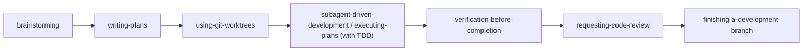
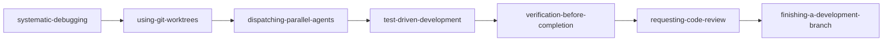
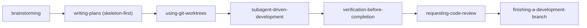
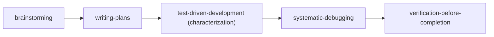

# Superpowers MCP: Skill Compositions & Workflow Pipelines

[English](skill-compositions.md) | [繁體中文](skill-compositions.zh-TW.md) | [日本語](skill-compositions.ja.md) | [한국어](skill-compositions.ko.md)

> **Source of truth:** this English document is canonical. Update it first when skill behavior changes, then sync the translations.


## 1. Choose a Workflow

These prompts are **interactive workflow launchers**, not server-side automation. Selecting one adds structured instructions to the conversation; the host agent must have file, terminal, and Git access and must call `read_skill` for each stage. The workflow pauses whenever a skill requires design approval, plan review, or a branch-finishing choice.

| Goal | MCP Prompt | What It Does |
| :--- | :--- | :--- |
| Build a new feature | `feature-pipeline` | Starts the complete interactive feature workflow. |
| Investigate and fix a complex bug | `structured-debug` | Starts the structured debugging workflow. |
| Plan a large refactor or migration | `skill-composition` with a refactor scenario | Recommends Pipeline 3; there is no dedicated launcher prompt yet. |
| Stabilize a legacy codebase | `skill-composition` with a legacy scenario | Recommends Pipeline 4; there is no dedicated launcher prompt yet. |

The portable invocation method is your client's **MCP Prompts menu**. Slash-command names vary by client and may include the configured MCP server name. Merely mentioning a prompt name in ordinary chat does not guarantee that the client will retrieve that MCP prompt.

The same guide is exposed to MCP clients as `guide://superpowers/skill-compositions`.

### Prerequisites

- Run in an agent session with access to the target repository, files, terminal, and Git.
- Worktree creation requires a Git repository and permission to create branches and directories.
- `subagent-driven-development` requires host-provided multi-agent tools. When unavailable, `feature-pipeline` uses `executing-plans` as its inline fallback.
- Pushes, pull requests, merges, and destructive cleanup remain explicit user decisions.

## 2. Why Skill Compositions Matter

The 15 core skills in `superpowers-mcp` span the entire software development lifecycle (SDLC): from requirements discovery, architecture planning, isolated workspace setup, test-driven development (TDD), and systematic debugging, to full verification, code review, and branch integration.

While each atomic skill acts as a precision engineering tool, production-grade development requires **workflow orchestration**. Skill compositions transform ad-hoc AI interactions into disciplined, reproducible, and safety-guarded engineering pipelines.

---

## 3. Core Architectural Principles

When composing skills, always enforce these five safety mechanisms:

1. **Isolation First (via Git Worktrees)**: Whenever coordinating multiple subagents or debugging independent hypotheses in parallel, always use `superpowers:using-git-worktrees` to avoid filesystem race conditions and workspace pollution.
2. **Test-Driven by Default (TDD)**: No code modifications should occur without a failing test first (Red-Green-Refactor cycle) to guarantee regression safety.
3. **Dual-Layer Review Gates**: Never skip task-level spec compliance checks or feature-level branch reviews (`requesting-code-review` / `receiving-code-review`).
4. **Full Verification Before Completion**: Run the entire project test suite, type-checker, and linter (`verification-before-completion`) before claiming done or merging branches.
5. **Remote-Safety Boundary (Local Commits Only)**: Keep commits local — no push/pull/fetch unless the plan or your human partner says so. Branch from a shared ref with `--no-track` (or `--unset-upstream` before the first commit) so a feature branch never tracks a shared branch, and never rewrite a shared branch (`git revert` is the only remedy you apply yourself).

---

## 4. Four Standard Workflow Pipelines

### Pipeline 1: End-to-End Feature Development
**Ideal for:** Building new features, major modules, or core subsystem enhancements.



| Step | Skill | Responsibility & Deliverable |
| :--- | :--- | :--- |
| **1. Requirements & Design** | `brainstorming` | Clarify intent, constraints, architecture decisions, and edge cases; confirm shared understanding, run the planning-handoff review, and output the Design Spec. |
| **2. Plan Construction** | `writing-plans` | Decompose Spec into bite-sized, testable tasks annotated with Recommended Skills. |
| **3. Workspace Isolation** | `using-git-worktrees` | Create an isolated Git worktree to protect the main branch and active work. |
| **4. Task Execution** | `subagent-driven-development` or `executing-plans` | Use fresh subagents when the host supports them; otherwise execute inline. Load `test-driven-development` for implementation tasks and enforce Red ➔ Green ➔ Refactor. |
| **5. Full Suite Verification** | `verification-before-completion` | Execute the full test suite, linter, and type checks to ensure zero regressions; when there is no test command, re-open the artifact and account for every part of the request. |
| **6. Adversarial Review** | `requesting-code-review` | Assemble review package and perform comprehensive code & architecture reviews. |
| **7. Branch Finalization** | `finishing-a-development-branch` | Export deferred findings (PR checklist or committed follow-ups file), then present the available merge/PR/keep choices and perform only the option the user selects. |

---

### Pipeline 2: Structured Troubleshooting & Multi-failure Debugging
**Ideal for:** Complex bugs, flaky tests, multiple test failures, or production incidents.



1. **`systematic-debugging`**: Investigate root causes and break failures into distinct, testable hypotheses.
2. **`using-git-worktrees`**: Provision isolated worktrees for parallel investigations to prevent test interference.
3. **`dispatching-parallel-agents`**: Dispatch concurrent subagents to validate or invalidate individual hypotheses.
4. **`test-driven-development`**: Write minimal failing reproduction tests before applying targeted bugfixes.
5. **`verification-before-completion`**: Validate that all repository tests pass with clean outputs.
6. **`requesting-code-review`** (and `receiving-code-review`): Review the fix delta, ensure defensive regression test coverage, and resolve review findings.
7. **`finishing-a-development-branch`**: Merge the bugfix branch, remove temporary worktrees, and clean up workspace.

---

### Pipeline 3: Large Refactoring & System Migration
**Ideal for:** Architectural refactors, framework migrations, or service decoupling.



1. **`brainstorming`**: Define interface contracts, transition strategies, and parity validation criteria.
2. **`writing-plans` (Skeleton-First Mode)**: Design the thinnest end-to-end slice across all subsystems first.
3. **`using-git-worktrees`**: Establish dedicated long-lived migration worktrees.
4. **`subagent-driven-development`**: Execute phased refactoring tasks with mandatory per-task review gates.
5. **`verification-before-completion`** + **`requesting-code-review`**: Full regression verification and architectural review.
6. **`finishing-a-development-branch`**: Merge migration branch, clean up worktrees, and finalize delivery.

---

### Pipeline 4: Legacy Codebase Safety Net
**Ideal for:** Legacy codebases lacking automated test coverage or consistent patterns.



1. **`brainstorming`**: Identify critical business paths and high-risk modules.
2. **`writing-plans`**: Create a roadmap for adding characterization and boundary tests.
3. **`test-driven-development`**: Author golden-master and regression tests against existing behaviors using the TDD characterization guard (mutate, verify failure, restore via VCS, stay green).
4. **`systematic-debugging`**: Root-cause hidden defects surfaced while establishing test baselines.
5. **`verification-before-completion`**: Solidify automated CI test barriers.

### Meta Skill: Session Forensics

Outside the four pipelines, **`diagnosing-superpowers`** reconstructs what went wrong in a past session from its on-disk transcripts: intake interview, session discovery, parallel analyst reports with cited evidence, then an optional scrubbed bundle or GitHub issue draft. Reach for it when a session ignored the plan, repeated work, or produced a result nobody can explain — and when the finding belongs upstream, it drafts the maintainer report too. The MCP server only serves the skill content; the agent reads the host's transcript files with its own tools, so no transcript ever crosses the server boundary.

---

## 5. Plan-Driven Skill Metadata Schema

In plans generated by `writing-plans`, specify recommended skills for each task:

```markdown
### Task 1: Implement Token Authentication Middleware
- **Goal**: Validate JWT tokens and extract user claims
- **Target Files**: `src/auth/jwt.ts`, `tests/auth/jwt.test.ts`
- **Recommended Skill**: `superpowers:test-driven-development`
- **Task Brief**:
  1. Write failing test for expired and invalid signatures (FAIL)
  2. Implement minimal signature verification (PASS)
  3. Refactor with strict type safety
```

### Controller-to-Subagent Dispatch Protocol
When the controller agent dispatches a task subagent:
1. The controller reads the `Recommended Skill` specified in the plan task.
2. The controller injects instructions or guides the subagent to load that skill via `read_skill(skill_name)`.
3. The subagent executes under the strict methodology of that skill (e.g., Red-Green-Refactor).

---

## 6. Native MCP Prompts Reference

`superpowers-mcp` provides native, ready-to-use MCP prompts across IDEs (Cursor, Antigravity, VS Code, Devin Desktop):

| MCP Prompt | Arguments | Purpose |
| :--- | :--- | :--- |
| **`feature-pipeline`** | required `feature_name`, optional `requirements` | Interactive launcher for end-to-end feature development. |
| **`structured-debug`** | `issue_description`, `failing_tests` | Interactive launcher for systematic debugging and optional multi-agent investigation. |
| **`skill-composition`** | `scenario` | Dynamic skill composition recommender for feature, debug, refactor, or legacy tasks. |
| **`session-start`** | - | Injects foundational Superpowers context and skill invocation rules. |
| **`sdd-implementer`** | `brief_file`, `task_name`, ... | SDD task implementer subagent prompt template. |
| **`sdd-task-reviewer`** | `brief_file`, `report_file`, `review_file`, ... | SDD per-task spec & quality reviewer prompt template. |
| **`sdd-re-review`** | `brief_file`, `review_file`, `previous_findings`, ... | SDD fix-round scoped re-reviewer prompt template. |
| **`spec-reviewer`** | `spec_file` | Adversarial design specification reviewer prompt template. |
| **`plan-reviewer`** | `plan_file`, `spec_file` | Adversarial implementation plan reviewer prompt template. |

---

## 7. Practical Usage Guide

With `superpowers-mcp` installed, start from a native MCP prompt and let its instructions load the required skills.

### Method A: MCP Prompts Menu (Recommended)
In a client that supports MCP prompts:
1. Confirm that the configured `superpowers` MCP server is connected.
2. **New Feature Development**: Select `feature-pipeline` and provide `feature_name` plus optional `requirements`.
3. **Troubleshooting & Bugfixes**: Select `structured-debug` and paste the error logs or failing test names.
4. **Custom / Architecture Tasks**: Select `skill-composition` to let the AI recommend the best pipeline for your scenario.

Your client may also expose a namespaced slash command. Consult its prompt picker for the exact syntax rather than assuming `/feature-pipeline` is portable.

### Method B: Natural-Language Fallback
You may ask the agent to follow a named workflow, but this does not guarantee that the client retrieves the native MCP prompt. For deterministic use, select it from the MCP Prompts menu.
- *"Please follow the `feature-pipeline` to build [Feature Name]."*
- *"Run the `structured-debug` workflow on this error: [Paste error / trace]."*
- *"Apply the Refactoring Pipeline from `docs/skill-compositions.md` to refactor [Module]."*

### 💬 Interactive Step-by-Step Walkthrough Example:
```text
[You]: (Selects the `feature-pipeline` MCP prompt and enters "coupon code checkout system".)
  ↓
[AI]: (Loads brainstorming with `read_skill`) "Understood. Does the coupon have an expiry date, and can it stack with site-wide sales?"
  ↓
[You]: "It has an expiry date, and it cannot stack."
  ↓
[AI]: (After design approval, loads `writing-plans`) "Created implementation plan at docs/superpowers/plans/... Please review."
  ↓
[You]: "Looks good, proceed."
  ↓
[AI]: (Creates or verifies a worktree ➔ uses SDD or the inline fallback ➔ implements via TDD ➔ verifies ➔ reviews ➔ presents branch-finishing choices)
  ↓
[AI]: "All tasks and full test suite passed (100%). Code review clean. Branch ready for merge!"
```
