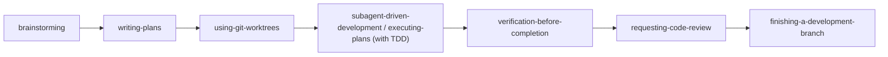
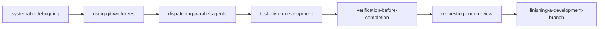
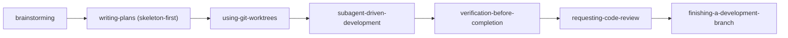
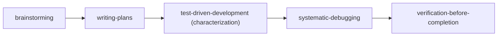

# Superpowers MCP: Composição de Skills e Pipelines de Workflow

[English](skill-compositions.md) | [繁體中文](skill-compositions.zh-TW.md) | [日本語](skill-compositions.ja.md) | [한국어](skill-compositions.ko.md) | [Español](skill-compositions.es.md) | [Português (BR)](skill-compositions.pt-BR.md) | [हिन्दी](skill-compositions.hi.md)

> **Fonte da verdade:** este documento em inglês é canônico. Atualize-o primeiro quando o comportamento das skills mudar e depois sincronize as traduções.


## 1. Escolha um workflow

Estes prompts são **lançadores interativos de workflow**, não automação no servidor. Selecionar um adiciona instruções estruturadas à conversa; o agente host precisa ter acesso a arquivos, terminal e Git, e precisa chamar `read_skill` em cada etapa. O workflow pausa sempre que uma skill exigir aprovação de design, revisão do plano ou uma decisão de finalização de branch.

| Objetivo | MCP Prompt | O que faz |
| :--- | :--- | :--- |
| Construir uma feature nova | `feature-pipeline` | Inicia o workflow interativo completo de features. |
| Investigar e corrigir um bug complexo | `structured-debug` | Inicia o workflow estruturado de debugging. |
| Planejar um grande refactor ou migração | `skill-composition` com cenário de refactor | Recomenda o Pipeline 3; ainda não há prompt lançador dedicado. |
| Estabilizar um codebase legado | `skill-composition` com cenário legado | Recomenda o Pipeline 4; ainda não há prompt lançador dedicado. |

O método portátil de invocação é o **menu de MCP Prompts** do seu cliente. Nomes de slash-command variam por cliente e podem incluir o nome do servidor MCP configurado. Apenas mencionar um prompt pelo nome no chat comum não garante que o cliente recupere aquele MCP prompt.

O mesmo guia é exposto aos clientes MCP como `guide://superpowers/skill-compositions`.

### Pré-requisitos

- Execute em uma sessão de agente com acesso ao repositório alvo, arquivos, terminal e Git.
- Criar worktrees exige um repositório Git e permissão para criar branches e diretórios.
- `subagent-driven-development` exige ferramentas multiagente do host. Quando indisponíveis, `feature-pipeline` usa `executing-plans` como fallback inline.
- Pushes, pull requests, merges e limpezas destrutivas continuam sendo decisões explícitas do usuário.

## 2. Por que composições de skills importam

As 15 skills principais do `superpowers-mcp` cobrem todo o ciclo de vida do software (SDLC): da descoberta de requisitos, planejamento de arquitetura, setup de workspaces isolados, desenvolvimento guiado por testes (TDD) e debugging sistemático, até verificação completa, code review e integração de branches.

Enquanto cada skill atômica funciona como uma ferramenta de engenharia de precisão, o desenvolvimento em nível de produção exige **orquestração de workflows**. As composições transformam interações ad-hoc com IA em pipelines disciplinados, reproduzíveis e com travas de segurança.

---

## 3. Princípios arquiteturais fundamentais

Ao compor skills, aplique sempre estes cinco mecanismos de segurança:

1. **Isolamento primeiro (via Git Worktrees)**: Sempre que coordenar múltiplos subagentes ou debugar hipóteses independentes em paralelo, use `superpowers:using-git-worktrees` para evitar race conditions e poluição do workspace.
2. **TDD por padrão**: Nenhuma modificação de código sem um teste falhando antes (ciclo Vermelho-Verde-Refatoração) para garantir segurança contra regressões.
3. **Gates de revisão em duas camadas**: Nunca pule checagens de conformidade com a spec por tarefa nem revisões de branch por feature (`requesting-code-review` / `receiving-code-review`).
4. **Verificação completa antes de concluir**: Rode toda a suíte de testes, o checador de tipos e o linter (`verification-before-completion`) antes de declarar pronto ou fazer merge de branches.
5. **Fronteira de segurança remota (só commits locais)**: Mantenha os commits locais — sem push/pull/fetch a menos que o plano ou seu parceiro humano diga. Crie o branch a partir de uma ref compartilhada com `--no-track` (ou `--unset-upstream` antes do primeiro commit) para que o branch de feature nunca rastreie um branch compartilhado, e nunca reescreva um branch compartilhado (`git revert` é o único remédio que você aplica sozinho).

---

## 4. Quatro pipelines padrão de workflow

### Pipeline 1: Desenvolvimento de features de ponta a ponta
**Ideal para:** Construir features novas, módulos grandes ou melhorias em subsistemas centrais.



| Etapa | Skill | Responsabilidade e entregável |
| :--- | :--- | :--- |
| **1. Requisitos e design** | `brainstorming` | Esclarece intenção, restrições, decisões de arquitetura e edge cases; confirma entendimento compartilhado, executa a revisão de handoff de planejamento e produz a Spec de design. |
| **2. Construção do plano** | `writing-plans` | Decompõe a Spec em tarefas pequenas e testáveis com Recommended Skills. |
| **3. Isolamento do workspace** | `using-git-worktrees` | Cria um worktree Git isolado para proteger o branch principal e o trabalho ativo. |
| **4. Execução das tarefas** | `subagent-driven-development` ou `executing-plans` | Usa subagentes novos quando o host suporta; senão, executa inline. Carrega `test-driven-development` para tarefas de implementação e aplica Vermelho ➔ Verde ➔ Refatoração. |
| **5. Verificação completa** | `verification-before-completion` | Executa toda a suíte de testes, linter e checagens de tipos para zero regressões; quando não há comando de testes, reabre o artefato e presta contas de cada parte do pedido. |
| **6. Revisão adversarial** | `requesting-code-review` | Monta o pacote de revisão e faz revisões abrangentes de código e arquitetura. |
| **7. Finalização do branch** | `finishing-a-development-branch` | Exporta achados diferidos (checklist de PR ou arquivo de follow-ups), apresenta as opções de merge/PR/manter e executa só a opção escolhida. |

---

### Pipeline 2: Troubleshooting estruturado e debugging multifalha
**Ideal para:** Bugs complexos, testes instáveis, múltiplas falhas ou incidentes em produção.



1. **`systematic-debugging`**: Investiga causas raiz e quebra as falhas em hipóteses distintas e testáveis.
2. **`using-git-worktrees`**: Prepara worktrees isolados para investigações paralelas e evita interferência entre testes.
3. **`dispatching-parallel-agents`**: Despacha subagentes concorrentes para validar ou invalidar cada hipótese.
4. **`test-driven-development`**: Escreve testes mínimos de reprodução que falham antes de aplicar correções pontuais.
5. **`verification-before-completion`**: Valida que todos os testes do repositório passam com saídas limpas.
6. **`requesting-code-review`** (e `receiving-code-review`): Revisa o delta da correção, garante cobertura defensiva de regressão e resolve os achados.
7. **`finishing-a-development-branch`**: Faz merge do branch do bugfix, remove worktrees temporários e limpa o workspace.

---

### Pipeline 3: Refatoração grande e migração de sistemas
**Ideal para:** Refactors arquiteturais, migrações de framework ou desacoplamento de serviços.



1. **`brainstorming`**: Define contratos de interface, estratégias de transição e critérios de paridade.
2. **`writing-plans` (modo Skeleton-First)**: Desenha primeiro a fatia end-to-end mais fina entre todos os subsistemas.
3. **`using-git-worktrees`**: Estabelece worktrees de migração dedicados e duradouros.
4. **`subagent-driven-development`**: Executa tarefas de refatoração por fases com gates de revisão obrigatórios por tarefa.
5. **`verification-before-completion`** + **`requesting-code-review`**: Verificação total de regressão e revisão arquitetural.
6. **`finishing-a-development-branch`**: Faz merge do branch de migração, limpa worktrees e finaliza a entrega.

---

### Pipeline 4: Rede de segurança para código legado
**Ideal para:** Códigos legados sem cobertura automatizada nem padrões consistentes.



1. **`brainstorming`**: Identifica caminhos críticos de negócio e módulos de alto risco.
2. **`writing-plans`**: Cria o roteiro para adicionar testes de caracterização e de borda.
3. **`test-driven-development`**: Cria testes golden-master e de regressão contra comportamentos existentes com a guarda de caracterização TDD (mutar, verificar falha, restaurar via VCS, stay green).
4. **`systematic-debugging`**: Encontra defeitos ocultos que emergem ao estabelecer baselines.
5. **`verification-before-completion`**: Consolida barreiras de CI automatizadas.

### Meta skill: Forense de sessões

Fora dos quatro pipelines, **`diagnosing-superpowers`** reconstrói o que deu errado numa sessão passada a partir de suas transcrições em disco: entrevista inicial, descoberta da sessão, relatórios paralelos com evidências citadas e depois um pacote anonimizado opcional ou rascunho de GitHub issue. Use quando uma sessão ignorou o plano, repetiu trabalho ou produziu um resultado inexplicável — e quando o achado pertence ao upstream, ele também redige o relatório para os mantenedores. O servidor MCP só serve o conteúdo da skill; o agente lê os arquivos de transcrição do host com suas próprias ferramentas, então nenhuma transcrição cruza a fronteira do servidor.

---

## 5. Esquema de metadados de skills em planos

Em planos gerados por `writing-plans`, especifique as skills recomendadas por tarefa:

```markdown
### Task 1: Implement Token Authentication Middleware
- **Goal**: Validate JWT tokens and extract user claims
- **Target Files**: `src/auth/jwt.ts`, `tests/auth/jwt.test.ts`
- **Recommended Skill**: `superpowers:test-driven-development`
- **Task Brief**:
  1. Write failing test for expired and invalid signatures (FAIL)
  2. Implement minimal signature verification (PASS)
  3. Refactor with strict type safety
```

### Protocolo de despacho controlador → subagente
Quando o agente controlador despacha um subagente de tarefa:
1. O controlador lê o `Recommended Skill` indicado na tarefa do plano.
2. O controlador injeta instruções ou orienta o subagente a carregar aquela skill via `read_skill(skill_name)`.
3. O subagente executa sob a metodologia estrita daquela skill (ex. Vermelho-Verde-Refatoração).

---

## 6. Referência de MCP Prompts nativos

`superpowers-mcp` oferece MCP prompts nativos prontos para usar em IDEs (Cursor, Antigravity, VS Code, Devin Desktop):

| MCP Prompt | Argumentos | Propósito |
| :--- | :--- | :--- |
| **`feature-pipeline`** | `feature_name` obrigatório, `requirements` opcional | Lançador interativo de desenvolvimento de features end-to-end. |
| **`structured-debug`** | `issue_description`, `failing_tests` | Lançador interativo de debugging sistemático e investigação multiagente opcional. |
| **`skill-composition`** | `scenario` | Recomendador dinâmico de composição para tarefas de feature, debug, refactor ou legado. |
| **`session-start`** | - | Injeta o contexto fundacional do Superpowers e regras de invocação. |
| **`sdd-implementer`** | `brief_file`, `task_name`, ... | Template de prompt de subagente implementador de tarefas SDD. |
| **`sdd-task-reviewer`** | `brief_file`, `report_file`, `review_file`, ... | Template de prompt revisor de spec e qualidade por tarefa SDD. |
| **`sdd-re-review`** | `brief_file`, `review_file`, `previous_findings`, ... | Template de re-revisor SDD de escopo da rodada de correção. |
| **`spec-reviewer`** | `spec_file` | Template de prompt revisor adversarial de specs de design. |
| **`plan-reviewer`** | `plan_file`, `spec_file` | Template de prompt revisor adversarial de planos de implementação. |

---

## 7. Guia prático de uso

Com o `superpowers-mcp` instalado, parta de um MCP prompt nativo e deixe que suas instruções carreguem as skills necessárias.

### Método A: Menu de MCP Prompts (recomendado)
Num cliente com suporte a MCP prompts:
1. Confirme que o servidor MCP `superpowers` configurado está conectado.
2. **Nova feature**: Selecione `feature-pipeline` e informe `feature_name` mais `requirements` opcional.
3. **Resolução e bugfixes**: Selecione `structured-debug` e cole os logs de erro ou nomes de testes que falham.
4. **Tarefas personalizadas / arquitetura**: Selecione `skill-composition` para que a IA recomende o melhor pipeline para seu cenário.

Seu cliente também pode expor um slash command com namespace. Consulte seu seletor de prompts para a sintaxe exata em vez de assumir que `/feature-pipeline` é portátil.

### Método B: Alternativa em linguagem natural
Você pode pedir ao agente que siga um workflow nomeado, mas isso não garante que o cliente recupere o MCP prompt nativo. Para uso determinístico, selecione-o no menu de MCP Prompts.
- *"Siga o `feature-pipeline` para construir [Nome da feature]."*
- *"Execute o fluxo `structured-debug` sobre este erro: [Cole erro / trace]."*
- *"Aplique o Pipeline de refatoração de `docs/skill-compositions.pt-BR.md` para refatorar [Módulo]."*

### 💬 Exemplo interativo passo a passo:
```text
[You]: (Selects the `feature-pipeline` MCP prompt and enters "coupon code checkout system".)
  ↓
[AI]: (Loads brainstorming with `read_skill`) "Understood. Does the coupon have an expiry date, and can it stack with site-wide sales?"
  ↓
[You]: "It has an expiry date, and it cannot stack."
  ↓
[AI]: (After design approval, loads `writing-plans`) "Created implementation plan at docs/superpowers/plans/... Please review."
  ↓
[You]: "Looks good, proceed."
  ↓
[AI]: (Creates or verifies a worktree ➔ uses SDD or the inline fallback ➔ implements via TDD ➔ verifies ➔ reviews ➔ presents branch-finishing choices)
  ↓
[AI]: "All tasks and full test suite passed (100%). Code review clean. Branch ready for merge!"
```
