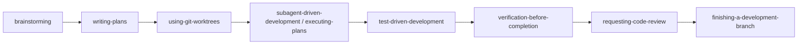
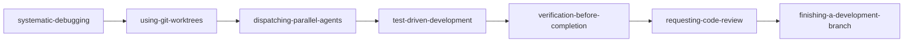
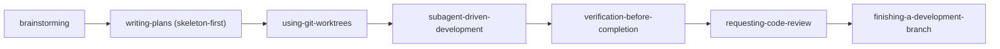
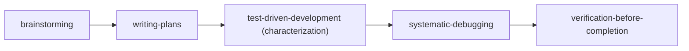

# Superpowers MCP：技能編排與工作流流水線指南 (Skill Compositions & Workflow Pipelines)

[English](skill-compositions.md) | [繁體中文](skill-compositions.zh-TW.md) | [日本語](skill-compositions.ja.md) | [한국어](skill-compositions.ko.md)

## 1. 為什麼需要技能組合 (Why Skill Compositions Matter)

`superpowers-mcp` 的 14 個核心技能涵蓋了現代軟體工程生命週期（SDLC）的各個階段：從需求澄清、架構規劃、隔離實作、TDD 開發、系統化除錯，到全套驗證、代碼審查與分支整合。

單一技能如同「高精度的專業工具」，但真實開發需要「工作流編排（Orchestration）」。透過技能組合（Skill Composition），能將鬆散的 AI 操作轉化為嚴謹、可重複驗證、防護嚴密的工程流水線。

---

## 2. 核心架構守則 (Core Architectural Principles)

在編排技能時，必須恪守以下四大防護機制：

1. **物理隔離優先 (Isolation First via Git Worktrees)**：凡涉及多 Agent 協作或平行除錯，必須強制使用 `superpowers:using-git-worktrees` 建立獨立目錄，防止檔案衝突 (Race Condition) 與環境污染。
2. **測試驅動開發 (TDD by Default)**：程式碼變更前必須先有失敗測試（Red-Green-Refactor），確保迴歸安全。
3. **雙層審查閘門 (Dual-layer Review)**：Task 級別的規格合規檢查與 Feature 級別的全面分支審查（`requesting-code-review` / `receiving-code-review`）不可省略。
4. **全套驗證後方可完結 (Verification Before Completion)**：在交付分支或聲明完成前，必須執行全專案測試套件（`verification-before-completion`）。

---

## 3. 四大標準工作流流水線 (Four Standard Workflow Pipelines)

### Pipeline 1: 端到端新功能開發 (Feature Development Pipeline)
**適用於：** 從零開發新功能、新增模組或重構核心流程。



| 步驟 | 技能 (Skill) | 職責與產出 |
| :--- | :--- | :--- |
| **1. 需求與設計** | `brainstorming` | 釐清需求、約束、架構決策與邊界條件，輸出 Spec/設計文檔。 |
| **2. 計畫制定** | `writing-plans` | 將 Spec 轉化為可獨立驗證的原子任務清單，標註 Recommended Skill。 |
| **3. 環境隔離** | `using-git-worktrees` | 建立獨立的 Git Worktree 工作區，保護主分支與日常工作。 |
| **4. 任務執行** | `subagent-driven-development` | 派發獨立 Subagent 依序執行任務，嚴守上下文乾淨原則。 |
| **5. 邏輯實作** | `test-driven-development` | 針對各任務邏輯，嚴格執行 Red ➔ Green ➔ Refactor 流程。 |
| **6. 全套驗證** | `verification-before-completion` | 執行專案完整測試套件、Linter、型別檢查，確認無迴歸問題。 |
| **7. 程式碼審查** | `requesting-code-review` | 產生 Review Package，發起多維度架構與程式碼品質審查。 |
| **8. 分支收尾** | `finishing-a-development-branch` | 合併/PR、清理 Worktree、刪除暫存分支，完成交付。 |

---

### Pipeline 2: 結構化多點除錯 (Structured Troubleshooting Pipeline)
**適用於：** 處理多個測試失敗、難以重現的 Bug 或生產環境 Incident。



1. **`systematic-debugging`**：分析根因，拆解為獨立的待驗證假說或子問題。
2. **`using-git-worktrees`**：為平行調查的子問題建立隔離 Worktrees，避免測試環境與檔案讀寫干擾。
3. **`dispatching-parallel-agents`**：平行分派 Agent 驗證各假說與修復方案。
4. **`test-driven-development`**：為確認的 Bug 編寫重現測試（Reproduction Test），接著進行修復。
5. **`verification-before-completion`**：驗證全部測試通過，確保修復未破壞其他功能。
6. **`requesting-code-review`**（與 `receiving-code-review`）：審查 Bugfix 差異與防護測試完整性，並徹底解決所有審查發現。
7. **`finishing-a-development-branch`**：完成分支合併/PR，安全刪除暫存 Worktree 與過期分支。

---

### Pipeline 3: 大型重構與系統遷移 (Large Refactoring & Migration Pipeline)
**適用於：** 核心架構重構、框架升級或微服務拆分。



1. **`brainstorming`**：定義新舊介面相容性、過渡策略與驗證標準。
2. **`writing-plans` (採用 Skeleton-First 模式)**：規劃端到端最小骨架，並拆解各子系統階段任務。
3. **`using-git-worktrees`**：建立重構專用長效 Worktree。
4. **`subagent-driven-development`**：分階段重構，每一階段均有獨立 Task Review 確保架構未走偏。
5. **`verification-before-completion`** + **`requesting-code-review`**：全面迴歸測試與專家架構審查。
6. **`finishing-a-development-branch`**：合併遷移分支，清理 Worktrees，乾淨收尾。

---

### Pipeline 4: 舊專案工程防護網建立 (Legacy Codebase Safety Net)
**適用於：** 缺乏單元測試或架構混亂的遺留代碼庫。



1. **`brainstorming`**：辨識系統關鍵路徑（Critical Path）與高風險模組。
2. **`writing-plans`**：制定防護測試（Characterization Tests）補充計畫。
3. **`test-driven-development`**：為既有行為編寫金絲雀測試與規格測試。
4. **`systematic-debugging`**：針對補測試過程中發現的潛在隱患進行根因排查。
5. **`verification-before-completion`**：建立 CI/CD 測試防線。

---

## 4. 計畫驅動的技能編排規格 (Plan-Driven Skill Metadata Schema)

在 `writing-plans` 產生的 Implementation Plan 中，可針對各任務指定建議使用的 Skill：

```markdown
### Task 1: 實作 Token 驗證中介軟體 (Token Middleware)
- **Goal**: 驗證 JWT Token 並解析 Claims
- **Target Files**: `src/auth/jwt.ts`, `tests/auth/jwt.test.ts`
- **Recommended Skill**: `superpowers:test-driven-development`
- **Task Brief**:
  1. 編寫 JWT 簽名與過期驗證測試 (FAIL)
  2. 實作驗證邏輯使測試通過 (PASS)
  3. 重構並確保型別安全
```

### 主 Agent 與 Subagent 調度協議
當主 Agent 根據 Plan 派發 Subagent 時：
1. 主 Agent 讀取 Task 中的 `Recommended Skill`。
2. 主 Agent 透過 `read_skill(skill_name)` 獲取該技能內容，或在 Prompt 中指示 Subagent 自行讀取。
3. Subagent 嚴格按照該技能的工作守則（例如 TDD 的紅綠重構環節）執行任務。

---

## 5. MCP Prompts 跨平台支援

為了讓 Cursor, Antigravity, VS Code, Devin Desktop 等客戶端能一鍵發起技能組合，`superpowers-mcp` 原生提供了標準 MCP Prompts：

| MCP Prompt 名稱 | 參數 | 用途 |
| :--- | :--- | :--- |
| **`feature-pipeline`** | `feature_name`, `requirements` | 啟動端到端新功能開發流水線引導 |
| **`structured-debug`** | `issue_description`, `failing_tests` | 啟動結構化除錯與平行假說驗證引導 |
| **`skill-composition`** | `scenario` | 根據開發情境動態推薦技能組合流程 |
| **`session-start`** | - | 注入 Superpowers 基礎環境與技能使用守則 |
| **`sdd-implementer`** | `brief_file`, `task_name`, ... | SDD 任務實作子代理 Prompt |
| **`sdd-task-reviewer`** | `brief_file`, `report_file`, ... | SDD 單一任務審查子代理 Prompt |
| **`sdd-re-review`** | `brief_file`, `previous_findings`, ... | SDD 修復輪次局部覆審子代理 Prompt |
| **`spec-reviewer`** | `spec_file` | 對抗式設計規格審查子代理 Prompt |
| **`plan-reviewer`** | `plan_file`, `spec_file` | 對抗式實作計畫審查子代理 Prompt |

---

## 6. 如何在 IDE 中實際操作與觸發 (How to Use in Practice)

只要安裝了 `superpowers-mcp`，您**完全不需要手動記住 14 個技能名稱**。有以下兩種最簡單的使用方式：

### 方式 A：使用 IDE 的 MCP Prompts 功能（最推薦、一鍵啟動）
在 Cursor, Antigravity, VS Code 或 Devin Desktop 的對話框中：
1. **開發新功能**：輸入 `/feature-pipeline` 或在 Prompts 選單中選擇 `feature-pipeline`，並輸入您的功能需求。
2. **排查 Bug / 失敗測試**：選擇 `structured-debug`，貼上錯誤訊息或測試檔案。
3. **不知道選什麼流程**：選擇 `skill-composition`，讓 AI 針對您的情境為您推薦專屬步驟。

### 方式 B：直接用自然語言告訴 AI
您也可以在任何對話中直接輸入以下指令，AI 會自動識別並載入標準管線：
- *「請按照 `feature-pipeline` 的流程，幫我開發 [功能名稱]」*
- *「請用 `structured-debug` 流程幫我分析並修復這個報錯：[貼上報錯訊息]」*
- *「請按照 `docs/skill-compositions.zh-TW.md` 的 Refactoring Pipeline 幫我重構 [模組名稱]」*

### 💬 實戰互動節奏示範（以開發新功能為例）：
```text
【您】:「請按照 feature-pipeline 開發購物車折扣券功能」
  ↓
【AI】: (自動執行 brainstorming) 「好的，請問折扣券是否有使用期限？是否能與其他優惠疊加？」
  ↓
【您】:「有期限，不能與全館折扣疊加」
  ↓
【AI】: (自動執行 writing-plans) 「設計已確認，我已生成實作計畫 docs/superpowers/plans/... 請確認任務清單」
  ↓
【您】:「計畫沒問題，開始執行」
  ↓
【AI】: (自動建立 worktree ➔ 啟動 SDD ➔ 各任務以 TDD 撰寫測試與代碼 ➔ 執行全套測試 ➔ 發起代碼審查 ➔ 收尾分支)
  ↓
【AI】: 「所有任務與全套測試皆已 100% 通過，Review 完成，分支已就緒！」
```
